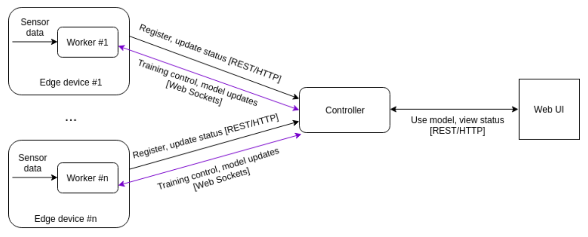

# Advanced Internet Computing WS 2020 - Group 7 Topic 3

## Use case

The goal of this project is to predict information based to data collected from distributed locations. Traditionally sensors collect such information and send them to a controller. The controller aggregates the data from multiple sensors and creates a machine learning model to predict unavailable values based on collected information. However, this architecture imposes security and resource problems. The data which has to be send to the controller might contain sensitive information and the amount of the data can require expensive infrastructure. To come around both of this problems, we implemented a federating learning approach on edge devices. In our architecture we replaced the sensors with workers which not only collect data but can compute machine learning models. Instead of the controller collecting data from sensors, the controller instructs each worker to update the current machine learning model. The worker stays owner over the data and only sends an updated model to the controller, instead of a big amount of data. The controller aggregates the models from each worker and provides the UI a method to apply it.

## Team and workload

Needless to say that each team member was highly involved and responsive when it came to helping each other, reviewing code and organizing our work. On top of that everybody had special responsibilities:

- [Marlon Alagoda](mailto:e1225958@student.tuwien.ac.at) … was bootstrapping the project, crafted the docker setup and implemented periodic training invocation. While our PySyft setup was not working he tried to replace it with Duet, which did not make it to the final solution. Together with Michael he was responsible for the presentation preperation.
- [Džan Operta](mailto:e11935976@student.tuwien.ac.at) … was responsible for pre-processing, importing and handling the data, integrating the machine learning architecture and data handling. He was debugging PySyft and finding a suitable way for our federated learning setup.
- [Gevorg Zakaryan](mailto:e11941370@student.tuwien.ac.at) … was the head of frontend. He had the main responsibility for the frontend architecture and crafted most of the required and additional Vue.js features. Also he implemented the device status simulation.
- [Michael Greisberger](mailto:e01054625@student.tuwien.ac.at) … was responsible implementing the device recruitment strategy, status and worker registration flow and visualising our model’s performance. Helped solving a bug with PySyft and Together with Marlon was responsible for the presentation preperation.

## Architecture



## Components and used technologies

### 1 Controller

The controller orchestrates the workers, invocates training rounds and provides and aggregated model to the UI. To instruct remote workers to update a model we used PySyft. To aggregate the model and make predictions PyTorch is in use. For the UI interaction a Flask server is started.

### 1 Frontend

The frontend provides information about the available workers, the accuracy of the current model and a method to use the current model. The frontend is implemented with Vue.js and uses axios to communicate with the controller.

### N Workers

The workers read data from their sensors and update a model when instructed by the controller. As a counterpart to the controller it uses PySyft to listen to remote training invocations. PySyft uses a websocket connection for communication under the hood.

## How to run

From the root of the repository type

```
docker-compose up
```

If you updated the source code, you can rebuild the docker container by adding `--build`

```
docker-compose up --build
```

You can start a specific container by appending it's name to the command, e.g.

```
docker-compose up controller
```

There are no configurations needed. PyTorch is rather big (~700MB), which is why the Docker build sometimes failes with an 137 exit code, which indicates an out of memory error. You might have to increase the memory limit your docker host can acquire. On macOS go to Docker Desktop -> Preferences -> Memory.
